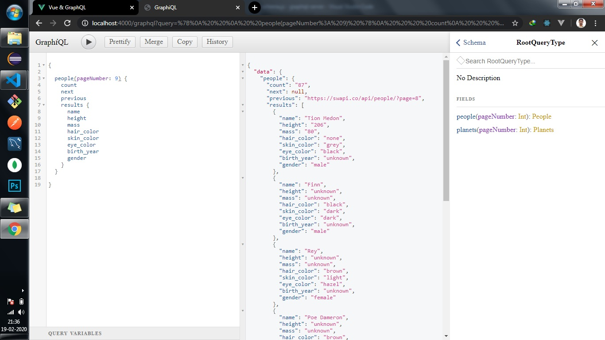

# GraphQL-Server
This GraphQL server is consuming star wars API.

### Login UI.


### People API Screen.


### Planets API Screen.


### Application Structure.


Please follow the below instrction to setup this application in your development environment.

## Project setup
```
npm install
```

### Compiles and hot-reloads for development
```
npm run server
```
